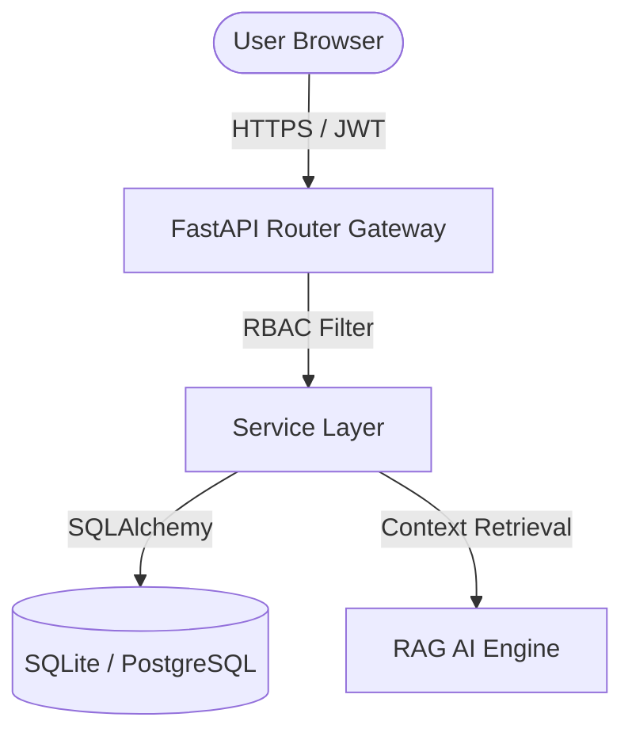

# CHC Bharno Hospital Information System (HIS)

An enterprise-grade, role-based Hospital Information System designed for Community Health Centre (CHC) Bharno, Jharkhand. Built with a React-Vite-TypeScript frontend and a FastAPI backend with integrated Retrieval-Augmented Generation (RAG) AI Assistance.

---

## 🚀 System Architecture Overview



---

## 🛠️ Tech Stack & Key Technologies

### Frontend
- **Framework**: React 18, Vite, TypeScript
- **Styling**: Vanilla CSS, Tailwind CSS, Lucide Icons, Shadcn/UI
- **State Management**: React Context API
- **Routing**: React Router

### Backend
- **Framework**: FastAPI (Python 3.12)
- **Database ORM**: SQLAlchemy 2.0 (Asyncio)
- **Migrations**: Alembic
- **Security**: JWT tokens, Argon2id password hashing, RBAC (Role-Based Access Control)
- **Database**: SQLite (Development), PostgreSQL (Production)

---

## 🌟 Key Features

1. **Role-Based Portals**: Personalized dashboards for Admins, Doctors, Nurses, Receptionists, Lab Techs, Pharmacists, and Patients.
2. **Scheduling Engine**: Interactive calendar with Day/Week/Month/Agenda views, automatic conflict checks, shift management, and leave workflows.
3. **RAG AI Assistant**: Contextual AI drawer parsing role-specific databases securely using Retrieval-Augmented Generation.
4. **Live System Health**: Popover showing health states (DB status, worker queues, API latency, security logs).
5. **Technical Operations**: IT telemetry monitoring logs, CPU metrics, failed login audits.

---

## 📦 Developer Onboarding & Installation

### Prerequisite Check
Ensure Node.js (v18+) and Python (v3.12+) are installed.

### Local Setup
1. **Backend Database Setup**:
   ```bash
   cd backend
   pip install -r requirements.txt
   alembic upgrade head
   python -m app.database.seed
   ```
2. **Start Backend Server**:
   ```bash
   uvicorn app.main:app --port 8000 --reload
   ```
3. **Frontend Roster Setup**:
   ```bash
   cd ..
   npm install
   npm run dev
   ```

---

## 🧪 Testing Suite

### Run Backend Tests
Run automated unit, API, and RBAC tests:
```bash
cd backend
python -m pytest
```

### Run End-to-End Validation
Run the integration workflow validation pipeline (Registration -> Booking -> Consultation -> Laboratory -> Pharmacy -> Billing -> Audits):
```bash
cd backend
python -m tests.e2e_workflow
```
