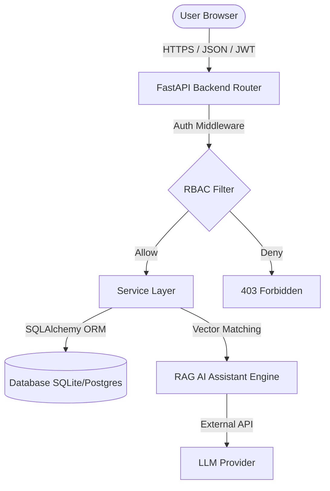

# System Architecture Documentation

This document describes the high-level architecture, request lifecycles, and design patterns of the **CHC Bharno Hospital Information System (HIS)**.

---

## 1. High-Level System Architecture

The system is designed around a modern three-tier client-server pattern:
1. **Presentation Layer (Frontend)**: Single-page application built on Vite, React 18, TypeScript, and Tailwind CSS.
2. **Application Layer (Backend)**: High-performance asynchronous REST API powered by FastAPI (Python 3.12).
3. **Database Layer (Persistence)**: Relational storage using SQLite (development) and PostgreSQL (production).

---

## 2. Request Lifecycle

The request lifecycle is uniform across all endpoints:

1. **Routing**: The client issues an HTTP request which is received by FastAPI APIRouter.
2. **Dependency Injection**:
   - Database session generator `get_db` opens a transaction scope.
   - Authentication dependency `get_current_active_user` verifies the JWT token signature and decodes the payload.
3. **RBAC Guarding**: Check whether the user's role has permission to execute the endpoint.
4. **Service Execution**: The request payload is handled by the appropriate service class (e.g. `SchedulerService`, `BillingService`).
5. **Persistence**: Operations are written to the database using SQLAlchemy async sessions.
6. **Response Serialization**: The return schema is serialized to JSON using Pydantic.

---

## 3. Security & Authentication Architecture

- **Token Handlers**: Authentication uses signed JWT tokens containing user ID, username, and role.
- **Password Protection**: Passwords are encrypted in the database using Argon2id hashing algorithms.
- **Audit Logging**: Sensitive changes (logins, prescription additions, laboratory results, billing modifications) automatically write audit logs.
