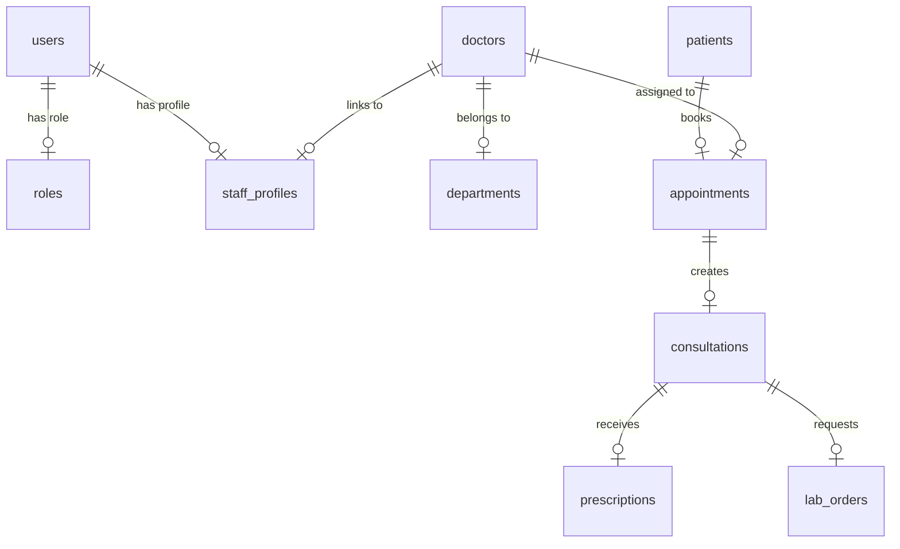

# Database Schema Documentation

This document describes the schema design, tables, primary/foreign keys, indices, and constraints of the CHC Bharno HIS.

---

## 1. Entity-Relationship Diagram (ERD)

---

## 2. Table Definitions

### `users`
Tracks general authentication details.
- **Fields**:
  - `id`: UUID (Primary Key)
  - `username`: VARCHAR(50) (Unique, Index)
  - `email`: VARCHAR(100) (Unique, Index)
  - `hashed_password`: VARCHAR(255)
  - `full_name`: VARCHAR(100)
  - `status`: VARCHAR(50) (e.g. 'active', 'inactive')
  - `role_id`: UUID (Foreign Key -> roles.id)

### `roles`
Exposes roles like System Administrator, Doctor, Receptionist, Lab Technician, Pharmacist, Nurse, Patient.
- **Fields**:
  - `id`: UUID (Primary Key)
  - `name`: VARCHAR(50) (Unique)
  - `description`: TEXT
  - `status`: VARCHAR(50)

### `doctors`
Doctor-specific profile mappings.
- **Fields**:
  - `id`: UUID (Primary Key)
  - `name`: VARCHAR(100)
  - `designation`: VARCHAR(100)
  - `qualification`: VARCHAR(100)
  - `available`: BOOLEAN
  - `department_id`: UUID (Foreign Key -> departments.id)
  - `staff_profile_id`: UUID (Foreign Key -> staff_profiles.id)

### `appointments`
Tracks OPD schedule slots.
- **Fields**:
  - `id`: UUID (Primary Key)
  - `token`: VARCHAR(50) (Index)
  - `date`: DATE (Index)
  - `time_slot`: VARCHAR(50)
  - `room`: VARCHAR(50)
  - `status`: VARCHAR(50) (e.g. 'Scheduled', 'Checked In', 'Cancelled')
  - `priority`: VARCHAR(50) (e.g. 'Normal', 'Urgent', 'Critical')
  - `patient_id`: UUID (Foreign Key -> patients.id)
  - `doctor_id`: UUID (Foreign Key -> doctors.id)

### `shifts`
Tracks daily staff roster.
- **Fields**:
  - `id`: UUID (Primary Key)
  - `user_id`: UUID (Foreign Key -> users.id)
  - `shift_type`: VARCHAR(50) (Morning, Evening, Night)
  - `date`: DATE (Index)
  - `start_time`: TIME
  - `end_time`: TIME

### `leaves`
Tracks leaves requests.
- **Fields**:
  - `id`: UUID (Primary Key)
  - `user_id`: UUID (Foreign Key -> users.id)
  - `start_date`: DATE
  - `end_date`: DATE
  - `leave_type`: VARCHAR(50)
  - `status`: VARCHAR(50) (Pending, Approved, Rejected)
